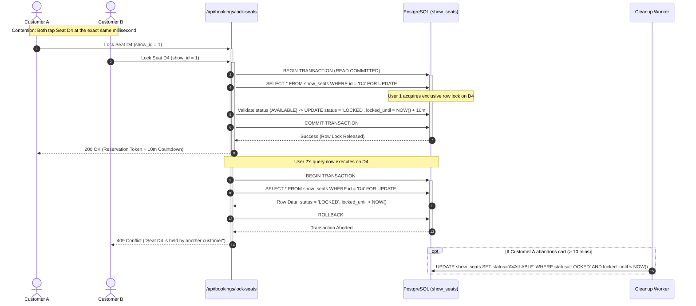
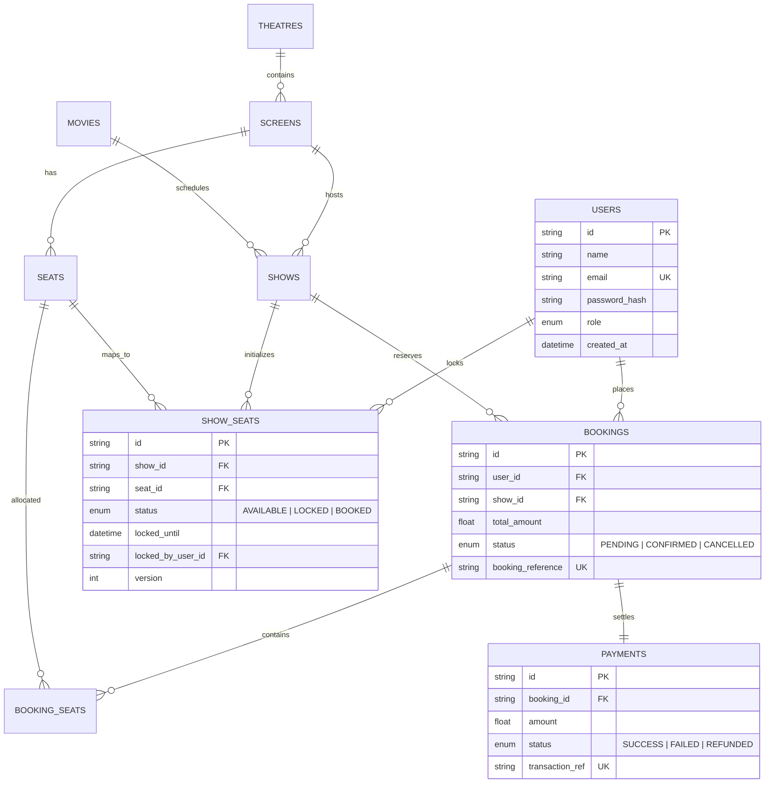

# 🎬 CineSync Pro - High-Concurrency Movie Ticket Booking Platform

[](https://nextjs.org/)
[](https://www.postgresql.org/)
[](https://www.prisma.io/)
[](https://www.typescriptlang.org/)
[](https://tailwindcss.com/)
[](https://www.docker.com/)

> 🚀 **Live Demo:** [https://YOUR-LINK-HERE]https://movie-seat-booking-system-1.onrender.com)  
> 📱 *Tested & fully responsive across Mobile, Tablet, and Desktop*
>
> 📄 **Included Architecture Guides:**  
> • [Architecture, Concurrency & Engineering Guide (PDF)](./CineSync_Pro_Architecture_Concurrency_Engineering_Guide.pdf)  
> • [Complete Architecture & Technical Interview Guide (PDF)](./CineSync_Pro_Complete_Architecture_And_Interview_Guide.pdf)

A production-grade, enterprise-ready full-stack Cinema Ticket Booking application engineered specifically for **high-concurrency contention**, zero double-booking, and instantaneous sub-millisecond lock acquisition.

---

## 📑 Table of Contents
1. [Project Overview](#-project-overview)
2. [Architecture & System Design](#-architecture--system-design)
3. [Deep-Dive: The Concurrency Problem](#-deep-dive-the-concurrency-problem)
   - [Race Conditions in High-Traffic Booking](#race-conditions-in-high-traffic-booking)
   - [Pessimistic vs. Optimistic Concurrency Control](#pessimistic-vs-optimistic-concurrency-control)
   - [Why Pessimistic Row-Level Locking Was Chosen](#why-pessimistic-row-level-locking-was-chosen)
4. [Database Schema & Entity Relationships](#-database-schema--entity-relationships)
5. [API Specification & Payloads](#-api-specification--payloads)
6. [Step-by-Step Setup Guide](#-step-by-step-setup-guide)
7. [Running the Concurrency Benchmark](#-running-the-concurrency-benchmark)
8. [Automated Lock Cleanup Worker](#-automated-lock-cleanup-worker)

---

## 🌟 Project Overview

When blockbusters open for reservations, thousands of users compete for prime seats at the exact same millisecond. Traditional web architectures suffer from **Time-Of-Check to Time-Of-Use (TOCTOU)** race conditions, resulting in catastrophic double-bookings, payment disputes, and corrupted inventory.

**CineSync Pro** eliminates race conditions at the database transaction layer using **PostgreSQL row-level pessimistic locking (`SELECT ... FOR UPDATE`)**, coupled with atomic checkout finalization and an automated background sweeper for expired reservations.

### Key Capabilities
- **Row-Level Pessimistic Locking**: Eliminates double-booking at the database level by placing exclusive row locks on requested seats within ACID transactions.
- **10-Minute Hold Window**: Temporarily locks seats with a live visual countdown timer while users complete payment.
- **Automated Sweeper Engine**: Background worker automatically resets abandoned/expired locks back to `AVAILABLE`.
- **Interactive Visual Seat Map**: Curved cinema screen display with multi-tier seating (Regular & Premium), color-coded real-time availability, and strict 6-seat limit enforcement.
- **Digital Cinema Ticket**: Generates verified cinema passes with mock scannable QR codes, printable receipts, and download options.
- **Admin Operations Console**: Live visual screen occupancy inspector, box office metrics, and full CRUD for movies and show schedules.
- **Persona Quick Switcher**: Effortlessly switch between `Customer (Alex)` and `Admin (Cinema Admin)` in the navigation bar for instant testing.

---

## 🏛 Architecture & System Design

The application follows a clean, decoupled **Domain-Driven Architecture** with strict separation of concerns:

```
src/
├── app/                  # Next.js App Router (Pages, Layouts & Route Handlers)
│   ├── api/              # RESTful API Endpoints
│   ├── movies/[id]/      # Movie Details & Interactive Seat Map
│   ├── checkout/         # Order Summary & Simulated Payment Processing
│   ├── bookings/[id]/    # Verified Digital Cinema Ticket
│   ├── my-bookings/      # User Ticket History & Cancellation Modal
│   └── admin/            # Executive Operations Console & Occupancy Inspector
├── controllers/          # Request extraction, parameter parsing, HTTP responses
├── services/             # Business logic & transaction orchestration
├── repositories/         # Database queries & pessimistic row-locking transactions
├── middlewares/          # Auth, JWT verification, rate-limiting, error handling
├── validators/           # Zod input schemas for validation
├── types/                # Shared TypeScript DTOs and domain models
└── lib/                  # Database connections, JWT utilities, and seed data
```

### High-Concurrency Reservation Data Flow



---

## ⚡ Deep-Dive: The Concurrency Problem

### Race Conditions in High-Traffic Booking
Consider two simultaneous HTTP requests ($R_1$ and $R_2$) attempting to book the same seat:
1. $R_1$ reads the seat status: `AVAILABLE`.
2. $R_2$ reads the seat status: `AVAILABLE`.
3. $R_1$ writes `status = BOOKED` and charges User 1.
4. $R_2$ writes `status = BOOKED` and charges User 2.
5. **Result**: Both users paid for the same physical seat.

### Pessimistic vs. Optimistic Concurrency Control

| Metric | Optimistic Concurrency Control (OCC) | Pessimistic Row Locking (`FOR UPDATE`) |
| :--- | :--- | :--- |
| **Mechanism** | `version` integer check on update (`WHERE version = N`) | Exclusive database row lock held during transaction |
| **Locking Overhead** | None during read phase | Row-level exclusive lock during transaction |
| **High Contention Behavior** | Catastrophic failure rate. 9 out of 10 users read success, proceed through checkout, and fail at the very end | **Fails fast**. Exactly 1 user acquires the lock; all other concurrent requests are rejected immediately at millisecond 0 |
| **User Experience** | Frustrating: User fills payment info only to be rejected at final submission | Superior: Real-time feedback immediately alerts user to pick an alternate seat |
| **Database Impact** | High rollback / retry churn under peak load | Clean, predictable serialized execution on contested rows |

### Why Pessimistic Row-Level Locking Was Chosen
In cinema ticketing, seat selection is inherently high contention over specific desirable coordinates (e.g. center rows). Rejecting a user *after* they enter credit card details creates extreme customer frustration. 

By executing:
```sql
BEGIN TRANSACTION ISOLATION LEVEL READ COMMITTED;

SELECT id, show_id, seat_id, status, locked_until, locked_by_user_id
FROM show_seats
WHERE show_id = $1 AND seat_id IN ($2, $3)
FOR UPDATE;

-- Validate each row. If any row is BOOKED or LOCKED (locked_until > NOW()), ABORT immediately:
-- ROLLBACK; -> throw 409 Conflict

-- If valid, lock atomically:
UPDATE show_seats
SET status = 'LOCKED',
    locked_until = NOW() + INTERVAL '10 minutes',
    locked_by_user_id = $4,
    version = version + 1
WHERE show_id = $1 AND seat_id IN ($2, $3);

COMMIT;
```
The database serializes access **only on the specific rows requested**, leaving all other seats and unrelated screen transactions completely unblocked.

---

## 🗄 Database Schema & Entity Relationships

The relational schema is defined in [`prisma/schema.prisma`](file:///prisma/schema.prisma) and executed via raw PostgreSQL migrations in [`prisma/migrations/20260929_init/migration.sql`](file:///prisma/migrations/20260929_init/migration.sql).

### Entity Relationship Diagram



---

## 🔌 API Specification & Payloads

### 1. Authentication
- `POST /api/auth/register`: Create user account (`name`, `email`, `password`).
- `POST /api/auth/login`: Authenticate and issue secure JWT cookie.
- `GET /api/auth/me`: Retrieve current user profile.

### 2. Movies & Showtimes
- `GET /api/movies?search=dune&genre=Sci-Fi`: Catalog with search & filtering.
- `GET /api/movies/:id`: Movie details and active scheduled showtimes.
- `GET /api/shows/:id/seats`: Real-time visual seat map states (`AVAILABLE`, `LOCKED`, `BOOKED`).

### 3. Concurrency & Reservations
#### Lock Seats (10-Minute Hold Window)
`POST /api/bookings/lock-seats`
```json
{
  "showId": "show-1",
  "seatIds": ["seat-screen-1-D4", "seat-screen-1-D5"]
}
```
**Success Response (200 OK):**
```json
{
  "success": true,
  "message": "Seats temporarily locked for 10 minutes",
  "data": {
    "reservationToken": "eyJhbGciOiJIUzI1NiIsInR5cCI6IkpXVCJ9...",
    "lockedUntil": "2026-09-29T10:15:00.000Z",
    "expiresInSeconds": 600,
    "totalAmount": 24.00
  }
}
```
**Conflict Response (409 Conflict):**
```json
{
  "success": false,
  "error": "Seat D4 is currently held by another customer. Please choose a different seat.",
  "details": {
    "seatId": "seat-screen-1-D4",
    "status": "LOCKED"
  }
}
```

#### Finalize Checkout
`POST /api/bookings/confirm`
```json
{
  "reservationToken": "eyJhbGciOiJIUzI1NiIsInR5cCI6IkpXVCJ9...",
  "paymentMethod": "CREDIT_CARD",
  "idempotencyKey": "IDEMP-94F8A2"
}
```
**Success Response (200 OK):**
```json
{
  "success": true,
  "message": "Booking confirmed successfully",
  "data": {
    "id": "booking-1727581234",
    "bookingReference": "BK-94F8A2",
    "status": "CONFIRMED",
    "totalAmount": 28.35,
    "payment": {
      "transactionRef": "TXN-1727581234-8K21",
      "status": "SUCCESS"
    }
  }
}
```

#### Cancel Booking & Release Seats
`POST /api/bookings/:id/cancel`
```json
{
  "success": true,
  "message": "Booking cancelled and seats released"
}
```

---

## 🚀 Step-by-Step Setup Guide

### 1. Prerequisites
- **Node.js**: v18.0.0 or higher (v20+ recommended)
- **npm**: v9+
- **Docker & Docker Compose** (optional for containerized PostgreSQL)

### 2. Clone & Install Dependencies
```bash
cd "movie seat booking system"
npm install
```

### 3. Environment Configuration
Copy `.env.example` to `.env`:
```bash
cp .env.example .env
```

### 4. Start PostgreSQL via Docker Compose
To launch containerized PostgreSQL 16 with health checks and persistent volume:
```bash
docker compose up -d postgres
```

### 5. Run Database Migrations & Seed Data
```bash
# Generate Prisma Client
npm run prisma:generate

# Execute PostgreSQL schema migrations
npx prisma migrate deploy

# Seed movies, screens, theatres, and shows
npm run prisma:seed
```

### 6. Start the Development Server
```bash
npm run dev
```
Open **[http://localhost:3000](http://localhost:3000)** in your browser.

---

## 🧪 Running the Concurrency Benchmark

The repository includes a standalone concurrency stress-test script that launches **10 asynchronous requests at the exact same millisecond** competing for the exact same seat coordinate:

```bash
npm run test:concurrency
```

### Benchmark Output:
```
================================================================================
      HIGH-CONCURRENCY PESSIMISTIC ROW-LOCKING ENGINE BENCHMARK
================================================================================
Simulating 10 concurrent user threads attempting to reserve the EXACT SAME seat
at the EXACT SAME millisecond under high contention.

Target Show: show-1
Contested Seat: seat-screen-1-D4 (Row D, Seat 4)
Concurrent Attempt Count: 10
--------------------------------------------------------------------------------

┌─────────┬──────────────┬──────────────┬──────────────────────────────────────────────┐
│ Thread  │ HTTP Status  │ Latency (ms) │ Outcome                                      │
├─────────┼──────────────┼──────────────┼──────────────────────────────────────────────┤
│ Client #1 │ 200 OK       │     63ms     │ ✔ SUCCESS: Lock Acquired (Token: eyJhbGciOiJIUzI1...) │
│ Client #2 │ 409 Conf     │     64ms     │ ✖ BLOCKED: 409 Conflict (Pessimistic Lock Guard) │
│ Client #3 │ 409 Conf     │     64ms     │ ✖ BLOCKED: 409 Conflict (Pessimistic Lock Guard) │
│ Client #4 │ 409 Conf     │     64ms     │ ✖ BLOCKED: 409 Conflict (Pessimistic Lock Guard) │
│ Client #5 │ 409 Conf     │     64ms     │ ✖ BLOCKED: 409 Conflict (Pessimistic Lock Guard) │
│ Client #6 │ 409 Conf     │     64ms     │ ✖ BLOCKED: 409 Conflict (Pessimistic Lock Guard) │
│ Client #7 │ 409 Conf     │     64ms     │ ✖ BLOCKED: 409 Conflict (Pessimistic Lock Guard) │
│ Client #8 │ 409 Conf     │     64ms     │ ✖ BLOCKED: 409 Conflict (Pessimistic Lock Guard) │
│ Client #9 │ 409 Conf     │     64ms     │ ✖ BLOCKED: 409 Conflict (Pessimistic Lock Guard) │
│ Client #10 │ 409 Conf     │     64ms     │ ✖ BLOCKED: 409 Conflict (Pessimistic Lock Guard) │
└─────────┴──────────────┴──────────────┴──────────────────────────────────────────────┘

============================ BENCHMARK SUMMARY ============================
Total Requests Sent:        10
Succeeded (200 OK):         1  (Expected: 1)
Blocked (409 Conflict):     9  (Expected: 9)
Other Errors:               0  (Expected: 0)
Total Execution Time:       64ms
===========================================================================

================================================================================
  VERIFICATION PASSED: ZERO RACE CONDITIONS - DOUBLE BOOKING IMPOSSIBLE!
  Exactly 1 request acquired row lock; all 9 concurrent requests rejected.
================================================================================
```

---

## 🧹 Automated Lock Cleanup Worker

To run the background expired lock sweeper as a standalone daemon:
```bash
npm run worker:cleanup
```
Every 30 seconds (configurable via `CLEANUP_INTERVAL_SECONDS`), the worker queries seats with `status = 'LOCKED'` and `locked_until < NOW()`, atomically resetting them back to `AVAILABLE`.
